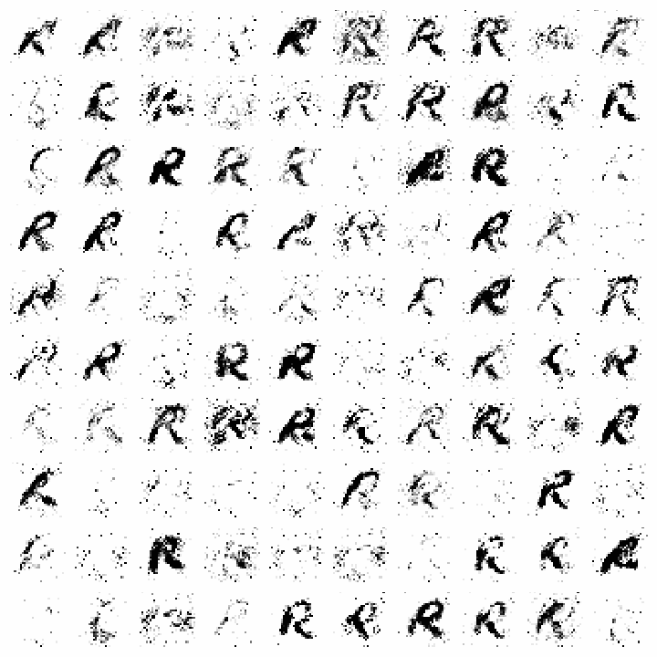
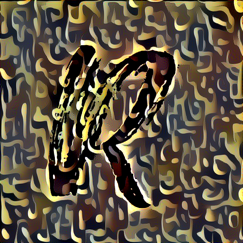
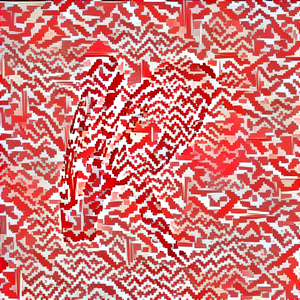

# GAN Art

<br>

## Overview

Our idea is merging something traditional with another thing not related to our culture

We chose the sword to be our traditional thing which reflects a strong part of our history and "English letter" to see how our culture symbol affects the letters and creates like a new Saudi font with different angles, curves, and lines.

----
<br>

## Solution Structure:
1. [Generate art symbol]():
    - Use GANs model to generate new images generated from English letters and sword shape.
2. [Apply traditional style]():
    - Use NST model to apply certain traditional style on generated images.

----
<br>

## Dataset:

We started with collecting two sets of pictures: one for curved sword, one for English letters (we choosed here R letter images only since its shape match more with sword).
So in this project we will try to reconstract new images by training 2 these two datasetes on Gans model.

<br>

**The first dataset is taken from this [Kaggle dataset](https://www.kaggle.com/sachinpatel21/az-handwritten-alphabets-in-csv-format):**
* Contains 26 handweitten letters (A-Z) images.
* Image size 28*28 pixels.
* Each image is stored as Gray-level.
* Each alphabet in the image is centre fitted to 20*20 pixel box.
* Images are saved as .CSV file

**The second datasets for curved sword:**
* Used this [script]() to download all possible pictures.


---
<br>


### Prerequisites
The requirements.txt file contains any Python dependencies. You can install them by running this command:

```
pip3 install -r requirements.txt
```

### Built With

- [Keras](https://keras.io/) - High-level neural networks API, running on top of TensorFlow, CNTK, or Theano.
- [OpenCV](https://en.wikipedia.org/wiki/OpenCV) - Library of programming functions mainly aimed at real-time computer vision.[
- [PIL](https://pillow.readthedocs.io/en/stable/) - Imaging Library by Fredrik Lundh and Contributors.


### Demo

- **Step 1: Generated images during training model**




<br>

- **Step 2: Generated images during training model**





----
<br>

### Resources:
<br>

- https://github.com/EvolvedSquid/tutorials/tree/master/gans
- https://towardsdatascience.com/neural-style-transfer-and-visualization-of-convolutional-networks-7362f6cf4b9b
